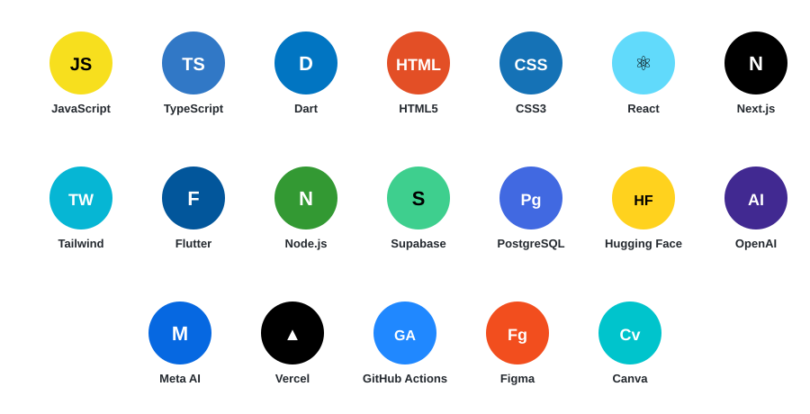

[README.md](https://github.com/user-attachments/files/30899244/README.3.md)

### Building AI-Powered Web Platforms 🚀

## About Me

Full Stack Developer and CS Graduate, Co-Founder at **DevNex Innovation**. I build AI-powered web platforms at the intersection of full-stack development and applied AI.

**What I do:**

- Architect scalable full-stack applications with React, Next.js, Node.js, and Supabase
- Build AI-powered products and workflows using Hugging Face, OpenAI, and Meta AI
- Design and ship client-facing web, app, and SaaS solutions at DevNex Innovation
- Lead branding, content, and digital marketing deliverables for the company

---

## Tech Stack

---

## 🚀 Launched Projects

- **SmartTour** : AI travel platform for Northern Pakistan
- **PixelLift** : AI-powered digital growth platform
- **DevNex** : Web & AI development agency

---

## 📊 GitHub Analytics

## 📫 Connect

  

"Building AI-powered platforms, one idea at a time."

